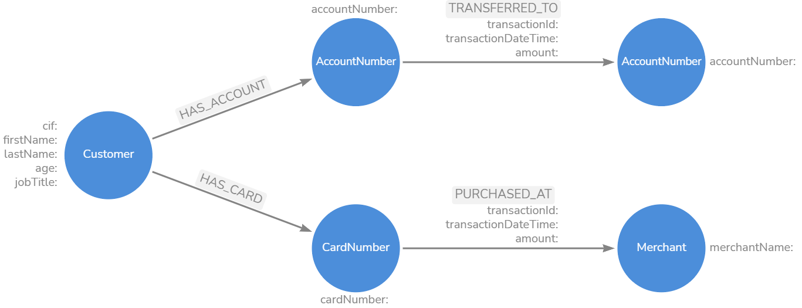

# Steps followed in the exercise

## Key problems / questions to solve

1. Top 5 customers in terms of card purchases (max. amount)

2. Top 5 merchant in terms of card purchases (max. amount)

3. Customers with most account transfers

4. Top merchant in terms of card purchases for an age band - 20-30yrs

5. Identify purchases within one hour of transfer to that account.


### Assumptions:

- All transactions are made in US dollars.
- Data model is modelled for the questions above.
- Certain information are excluded on purpose for eg. Country.

## Running a docker Neo4j-Entreprise

Run the below command replacing `$HOME` with the directory where the data files needs to be placed.

```
docker run \
    --name demoneo4j \
    -p7474:7474 -p7687:7687 \
    -d \
    -v $HOME/neo4j/data:/data \
    -v $HOME/neo4j/logs:/logs \
    -v $HOME/neo4j/import:/var/lib/neo4j/import \
    -v $HOME/neo4j/plugins:/plugins \
    --env NEO4J_AUTH=neo4j/test \
    --env NEO4J_ACCEPT_LICENSE_AGREEMENT=yes \
    neo4j:enterprise
```

## Data model for the problem statement



## Script for Loading Data


## Exploratory Queries


[Data Model](https://google.com)

