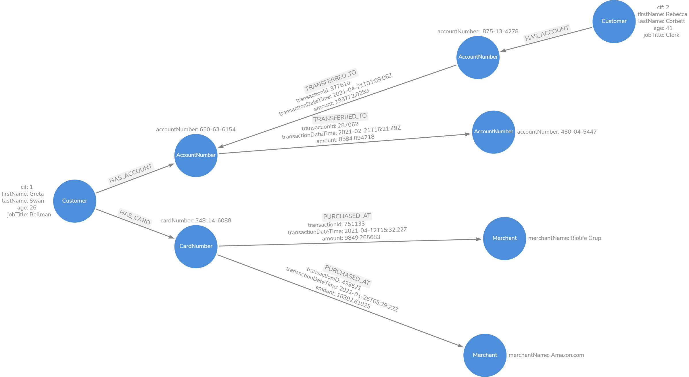
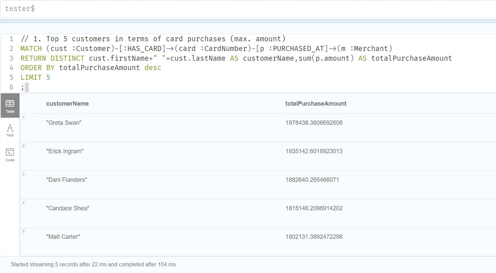
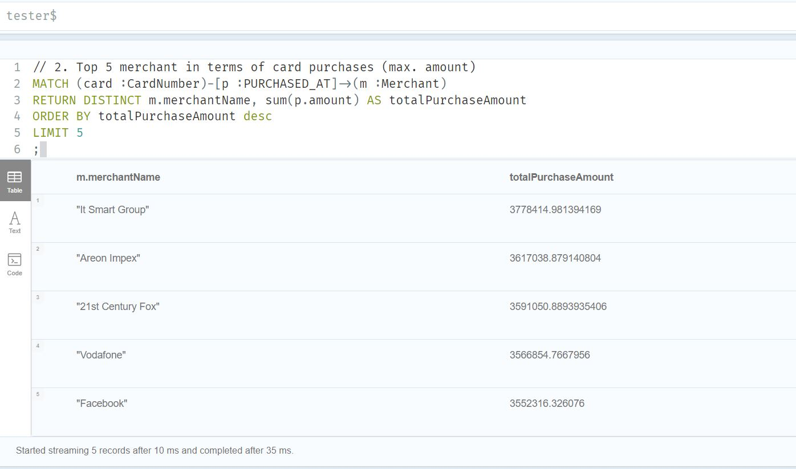
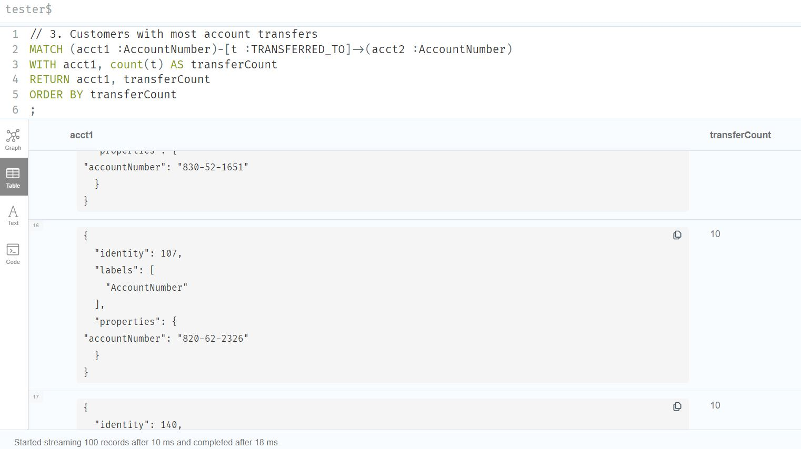
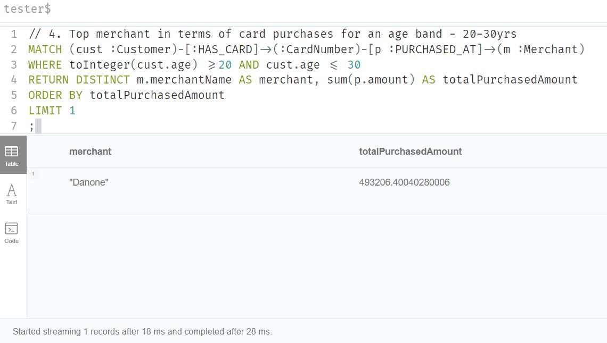
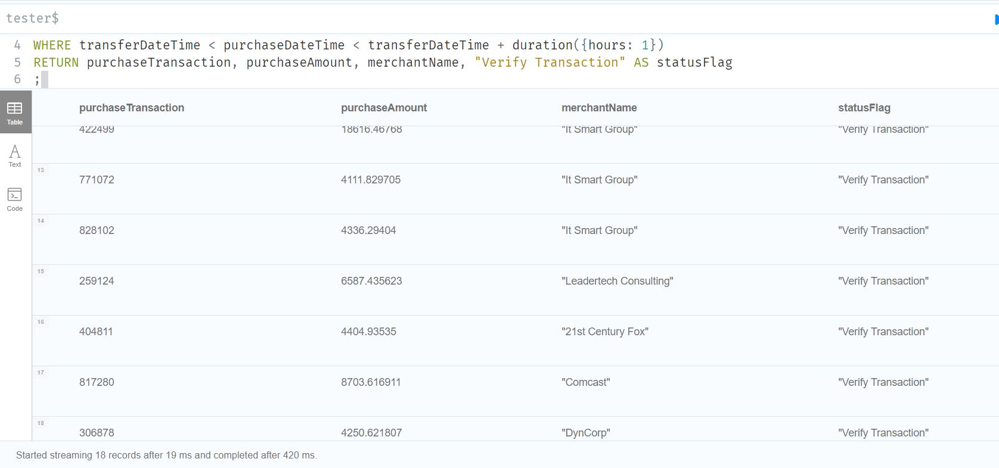

# Steps followed in the exercise

## Key problems / questions to solve

Below questions will be used to define data model - nodes and relationships.

1. Top 5 customers in terms of card purchases (max. amount)

2. Top 5 merchant in terms of card purchases (max. amount)

3. Customers with most account transfers

4. Top merchant in terms of card purchases for an age band - 20-30yrs

5. Identify purchases within one hour of transfer to that account.


### Assumptions:

- All transactions are made in US dollars.
- Data model is modelled for the questions above.
- Certain information are excluded on purpose for eg. Country.

## Running a docker Neo4j-Entreprise

Run the below command replacing `$HOME` with the directory where the data files needs to be placed.

```
docker run \
    --name demoneo4j \
    -p7474:7474 -p7687:7687 \
    -d \
    -v $HOME/neo4j/data:/data \
    -v $HOME/neo4j/logs:/logs \
    -v $HOME/neo4j/import:/var/lib/neo4j/import \
    -v $HOME/neo4j/plugins:/plugins \
    --env NEO4J_AUTH=neo4j/test \
    --env NEO4J_ACCEPT_LICENSE_AGREEMENT=yes \
    neo4j:enterprise
```

Logon to Neo4j Browser and make sure to create a database.
For this demo have used db name `tester`

## Data model for the problem statement
Below is the data model, the json export can found at 
\
`datamodel/Bank_customer_transaction.json`
\
\

\
\

Below is a sample instance model:


\
\
Below are the considerations for the data model:
- Account and Card nodes have been separated to enable for future account and card additions to a customer.
- Customer address can be separated out as separate node but in this use case there is limited need for address info - hence address data was not loaded to graph database.
- Account and Card can have relationship link (for eg. sharing customer number) if there are more transfer to purchase relationship analysis.

## Script for Loading Data

The data ingestion has been performed with both Cypher (csv) and Python:

- `loaddata_explore\csv` - contains cypher based dataload and exploration queries.
    - `load_csv.cyp` - is used to load data.
    - `exploratory_queries.cyp` - are the queries used for exploration.
- `loaddata_explore\python` - contains python based dataload and exploration queries.
    - `data` - folder contains main data load files: 
        - **`driver.py`** that returns driver class instance.
        - **`loaddata.py`** downloads and loads the file - where main function acts as orchestration.
    - `tests` - contains the tests to both driver and loaded data.
    - **`Explore.ipynb`** - contains the result of exploratory queries executed.
    - `black` - package has been used for formatting.
    - `flake8` - package has been used for linting.
    - `requirements.txt` - python packages used for the exercise.
    - `env.example` - sample environment file.

### Steps for executing python code:

1. **Load Data** - To load data follow below steps:
    - Ensure Neo4j Enterprise is up and running.
    - Update Neo4j URL, User and Pass in `.env.example`.
    - Copy `.env.example' to .env.
    - Execute `loaddata.py` python file.
    - Check database for data.
2.  **Testing** - to test driver and data, run below steps:
    - Update syspath in `tests/conftest.py` and path in `tests\02_test_data_load.py`.
    - Execute `tests\01_test_neo4j_connectivity.py` file for testing driver.
    - Execute `tests\02_test_data_load.py` file to test loaded data.
        - Note: the above test will load data as it executes `loaddata.py`, comment `test_load_data` test to stop loading data.

## Exploratory Queries

Once Data is loaded, execute the jupyter notebook at `loadata_explore/python/Explore.ipynb` to gather results of the 5 exploratory queries.

##### Below is a snapshot of results for the 5 queries:

###### Result of Query 1


###### Result of Query 2


###### Result of Query 3


###### Result of Query 4


###### Result of Query 5


#### Considerations for the exercise:
- No Index were set, but is a good practice to set index per node that helps identify unique node. A good example would be CIF for Customer table.
- Data model may vary based on use cases.
- The data load and exploration, can also be executed using cypher queries.
- Visual Studio Code was used for the development and JupyterHub for running `Explore.ipynb`. 
